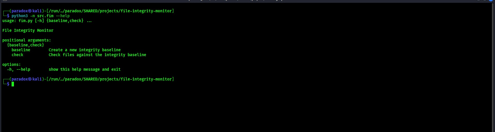
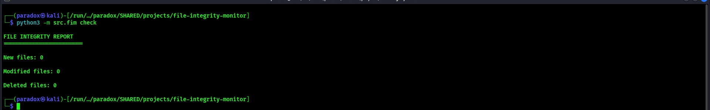

# File Integrity Monitor

A Python-based cybersecurity tool that detects filesystem changes
using SHA-256 cryptographic hashes.

The project is designed as a practical security engineering project
covering file integrity monitoring, security logging, automated
testing, input validation, and secure development practices.

## Project Status

**Version:** 1.0.0  
**Status:** Stable portfolio release

## Why This Project?

File Integrity Monitoring (FIM) is a security technique used to detect
unexpected changes to important files.

## Demo

### CLI Interface

The tool provides separate commands for creating a trusted baseline
and checking filesystem integrity.

### Clean Integrity Check

When the monitored filesystem matches the trusted baseline, the
monitor reports no changes.

### Integrity Violation Detection

When a monitored file is modified, the SHA-256 hash changes and the
FIM identifies the file as modified.

